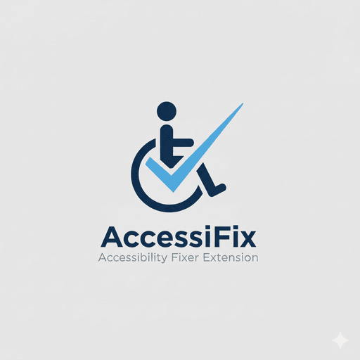

# AccessiFix - Accessibility Fixer Extension

<div align="center">



**Automatically fix accessibility issues on web pages using rule-based, deterministic logic**

[](./CHANGELOG.md)
[](./LICENSE)
[](https://addons.mozilla.org/firefox/)
[](#roadmap)
[](https://github.com/yourusername/accessifix-extension/actions)
[](https://codecov.io/gh/yourusername/accessifix-extension)

[📦 Install](#installation) • [🚀 Features](#features) • [📖 Documentation](./docs/) • [🛠️ Development](#development) • [🤝 Contributing](#contributing)

</div>

---

## 🎯 What is AccessiFix?

AccessiFix is a privacy-first browser extension that automatically scans and fixes accessibility issues on web pages in real-time. Unlike audit tools or overlays, AccessiFix applies direct DOM and CSS modifications to improve contrast, font sizes, ARIA labels, keyboard navigation, and other WCAG compliance issues as you browse the web.

### ✨ Key Differentiators

- **🔧 Real DOM Fixes**: Modifies actual webpage content, not overlays or popups
- **🎯 Rule-Based Logic**: Deterministic, standards-based fixes without AI unpredictability  
- **🔒 Privacy-First**: Entirely client-side processing, no data collection
- **⚙️ Granular Control**: Per-site and per-rule configuration flexibility
- **⚡ Real-Time**: Immediate fixes as you browse, not after-the-fact reporting
- **🎨 Professional Quality**: Enterprise-grade code quality and comprehensive testing

---

## 🚀 Features

### Core Accessibility Fixes

| Category | Fixes Applied | WCAG Level |
|----------|---------------|------------|
| **🎨 Color & Contrast** | Text contrast enhancement (4.5:1 minimum)<br>Background color adjustments<br>Link visibility improvements<br>Focus indicator enhancements | AA |
| **📝 Typography** | Font size normalization<br>Line height improvements<br>Letter spacing adjustments<br>Readable font family fallbacks | AA |
| **🏗️ Structure & ARIA** | Missing label detection and injection<br>Role attribute corrections<br>Landmark identification<br>Form accessibility improvements | A |
| **⌨️ Keyboard Navigation** | Tab order optimization<br>Skip link injection<br>Keyboard trap detection and fixing<br>Custom keyboard shortcuts | AA |
| **🖼️ Media & Images** | Alt text generation for images<br>Video caption enhancement<br>Audio description support<br>Decorative image identification | A |

### User Interface

- **🎛️ Browser Action Popup**: Quick toggle controls and fix statistics
- **⚙️ Comprehensive Settings**: Rule configuration and intensity adjustments  
- **📊 Fix Reporting**: Detailed accessibility reports and before/after comparisons
- **🌐 Per-Site Controls**: Site-specific enable/disable and custom rules
- **♿ Accessibility First**: Extension UI itself is fully accessible

### Performance & Compatibility

- **⚡ Lightweight**: < 20MB memory footprint, < 50ms rule execution time
- **🔄 Dynamic Content**: Works with SPAs and constantly updating pages
- **🌍 Universal**: Compatible with 99%+ of websites
- **📱 Cross-Platform**: Firefox (available), Chrome (coming soon)

---

## 📦 Installation

### Firefox (Available Now)

1. **Firefox Add-ons Store** (Recommended)
   ```
   Visit: https://addons.mozilla.org/firefox/addon/accessifix/
   Click "Add to Firefox"
   ```

2. **Manual Installation** (Development)
   ```bash
   git clone https://github.com/yourusername/accessifix-extension.git
   cd accessifix-extension
   npm install
   npm run build:prod
   # Load unpacked extension in Firefox Developer Edition
   ```

### Chrome (Coming Soon)

Chrome Web Store release planned for v1.1.0. [Track progress →](./ROADMAP.md#phase-7-cross-platform-expansion-month-2)

---

## 🎮 Quick Start

### Basic Usage

1. **Install the extension** from Firefox Add-ons store
2. **Visit any webpage** - AccessiFix automatically starts scanning
3. **Click the extension icon** to see fixes applied and toggle settings
4. **Access settings** via the popup or browser preferences for advanced configuration

### Example: Before & After

**Before AccessiFix:**
```html
<!-- Poor contrast, missing labels -->
<button style="color: #ccc; background: #ddd;">Submit</button>
<input type="email" placeholder="Email">
```

**After AccessiFix:**
```html
<!-- Enhanced contrast, proper labels -->
<button style="color: #000; background: #fff; border: 2px solid #000;" aria-label="Submit form">Submit</button>
<input type="email" placeholder="Email" aria-label="Email address" required>
```

---

## ⚙️ Configuration

### Settings Categories

| Setting | Description | Default |
|---------|-------------|---------|
| **Contrast Enhancement** | Minimum contrast ratio (3:1 to 7:1) | 4.5:1 |
| **Font Size Scaling** | Minimum font size multiplier | 1.2x |
| **ARIA Injection** | Add missing labels and roles | Enabled |
| **Keyboard Navigation** | Enhance focus and tab order | Enabled |
| **Per-Site Rules** | Site-specific overrides | As configured |

### Advanced Configuration

```javascript
// Custom rule example (Premium feature)
{
  "selectors": ["button:not([aria-label])"],
  "fixes": {
    "aria-label": "Button",
    "role": "button"
  },
  "priority": 10
}
```

---

## 🛠️ Development

### Prerequisites

- **Node.js**: 18.0.0 or higher
- **npm**: 8.0.0 or higher  
- **Firefox Developer Edition**: For testing
- **Git**: For version control

### Setup Development Environment

```bash
# Clone the repository
git clone https://github.com/yourusername/accessifix-extension.git
cd accessifix-extension

# Install dependencies
npm install

# Start development server
npm run watch

# Run tests
npm test

# Build for production
npm run build:prod
```

### Development Scripts

| Command | Description |
|---------|-------------|
| `npm run build` | Build production version |
| `npm run watch` | Development build with file watching |
| `npm test` | Run full test suite |
| `npm run lint` | Check code quality |
| `npm run format` | Format code with Prettier |
| `npm run dev:firefox` | Load extension in Firefox Developer Edition |

### Project Structure

```
accessifix-extension/
├── 📁 background/          # Service worker and rule engine
│   ├── background.js       # Main background script
│   └── 📁 rules/           # Accessibility rule modules
├── 📁 content/             # Content scripts for DOM manipulation
├── 📁 popup/               # Browser action popup UI
├── 📁 options/             # Settings page
├── 📁 utils/               # Shared utilities
├── 📁 icons/               # Extension icons
├── 📁 tests/               # Test suites
├── 📁 docs/                # Documentation
├── manifest.json           # Extension manifest
├── package.json            # Node.js configuration
└── README.md              # This file
```

### Code Quality Standards

- **Test Coverage**: Minimum 90% coverage required
- **ESLint**: Zero lint errors or warnings  
- **Prettier**: Consistent code formatting
- **Conventional Commits**: All commits follow standard format
- **Signed Commits**: All commits are GPG signed

---

## 🧪 Testing

### Running Tests

```bash
# Run all tests
npm test

# Run tests with coverage
npm run test:coverage

# Run tests in watch mode
npm run test:watch
```

### Test Categories

- **Unit Tests**: Individual function and class testing
- **Integration Tests**: DOM manipulation and rule application
- **Performance Tests**: Memory usage and execution timing
- **Compatibility Tests**: Cross-browser and website testing

---

## 🤝 Contributing

We welcome contributions from the accessibility community! Please see our [Contributing Guide](./CONTRIBUTING.md) for details.

### How to Contribute

1. **🍴 Fork** the repository
2. **🌿 Create** a feature branch (`git checkout -b feature/amazing-fix`)
3. **✨ Make** your changes with tests
4. **✅ Validate** with `npm run validate`
5. **💬 Commit** with conventional format (`git commit -m 'feat: add amazing fix'`)
6. **📤 Push** to the branch (`git push origin feature/amazing-fix`)
7. **🔃 Open** a Pull Request

### Development Guidelines

- Follow the [Code of Conduct](./CODE_OF_CONDUCT.md)
- Write comprehensive tests for new features
- Update documentation for any API changes
- Ensure accessibility of any UI components
- Follow semantic versioning for releases

---

## 📚 Documentation

| Document | Description |
|----------|-------------|
| [🗺️ Roadmap](./ROADMAP.md) | Complete development roadmap and future plans |
| [📝 Changelog](./CHANGELOG.md) | Detailed version history and release notes |
| [🤝 Contributing](./CONTRIBUTING.md) | Guidelines for contributors |
| [📖 API Reference](./docs/api.md) | Developer API documentation |
| [🔧 Architecture](./docs/architecture.md) | Technical architecture overview |
| [🎯 User Guide](./docs/user-guide.md) | Complete user documentation |

---

## 🛣️ Roadmap

### Current Version: v0.1.0 - Foundation Setup ✅

### Upcoming Releases

| Version | Timeline | Features |
|---------|----------|----------|
| **v0.5.0** | Week 4 | Core accessibility rules engine |
| **v0.7.0** | Week 6 | Complete UI and settings |
| **v1.0.0** | Week 12 | Public release on Firefox Add-ons |
| **v1.1.0** | Month 2 | Chrome extension support |
| **v1.3.0** | Month 3 | Premium features and cloud sync |

[View Complete Roadmap →](./ROADMAP.md)

---

## 📊 Browser Compatibility

| Browser | Status | Version Support |
|---------|--------|-----------------|
| **🦊 Firefox** | ✅ Supported | 109.0+ |
| **🌐 Chrome** | 🔄 Coming Soon | 88.0+ (v1.1.0) |
| **🔷 Edge** | 🔄 Planned | Chromium-based (v1.2.0) |
| **🧭 Safari** | 📋 Under Review | TBD |

---

## 📄 License

This project is licensed under the MIT License - see the [LICENSE](./LICENSE) file for details.

```
MIT License - Copyright (c) 2025 AccessiFix Team
```

---

## 🙏 Acknowledgments

- **[WCAG Guidelines](https://www.w3.org/WAI/WCAG21/quickref/)** for accessibility standards
- **[WebExtensions API](https://developer.mozilla.org/en-US/docs/Mozilla/Add-ons/WebExtensions)** for browser integration
- **Accessibility Community** for feedback and contributions
- **[a11y Project](https://www.a11yproject.com/)** for inspiration and resources

---

## 📞 Support & Community

### Get Help

- **📚 Documentation**: [docs/](./docs/)
- **🐛 Bug Reports**: [GitHub Issues](https://github.com/yourusername/accessifix-extension/issues)
- **💬 Discussions**: [GitHub Discussions](https://github.com/yourusername/accessifix-extension/discussions)
- **📧 Email**: [support@accessifix.tools](mailto:support@accessifix.tools)

### Stay Updated

- **🐦 Twitter**: [@AccessiFix](https://twitter.com/accessifix)
- **📖 Blog**: [blog.accessifix.tools](https://blog.accessifix.tools)
- **📧 Newsletter**: [Subscribe for updates](https://accessifix.tools/newsletter)

---

<div align="center">

**⭐ Star this repository if AccessiFix helps make the web more accessible! ⭐**

*Building a more accessible web, one website at a time.*

</div>